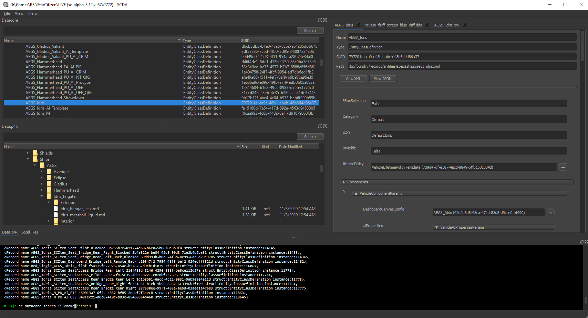

# StarCitizen Data Viewer - SCDV

A GUI built on top of [scdatatools](https://gitlab.com/scmodding/frameworks/scdatatools).

### NOTE: scdv is considered pre-alpha. It's more of a proof of concept than a fully functional tool

If you have any problems or suggestions, create an [issue](https://gitlab.com/scmodding/tools/scdv/-/issues/new)!

# Features

- Browse and export files from `Data.p4k`
- Automatically converts `CryXmlb` files
- File viewer for human readable files
- Image utilities for Star Citizen `.dds` textures
- Integrated Python console for scripted access to the `p4k` and `datacore`
- Game audio explorer with auto-conversion
- Blender Integration and Add-ons

# Releases

Check the [releases](https://gitlab.com/scmodding/tools/scdv/-/releases) for pre-built packages.

# Documentation

See the [SCDV Wiki](https://gitlab.com/scmodding/tools/scdv/-/wikis/home) for more information on how SCDV works. If you're interested in helping out, check out the [Developer Guide](https://gitlab.com/scmodding/tools/scdv/-/wikis/Developer-Guide)!

###

This project is not endorsed by or affiliated with the Cloud Imperium or Roberts Space Industries group of companies.
All game content and materials are copyright Cloud Imperium Rights LLC and Cloud Imperium Rights Ltd..  Star Citizen®,
Squadron 42®, Roberts Space Industries®, and Cloud Imperium® are registered trademarks of Cloud Imperium Rights LLC.
All rights reserved.
